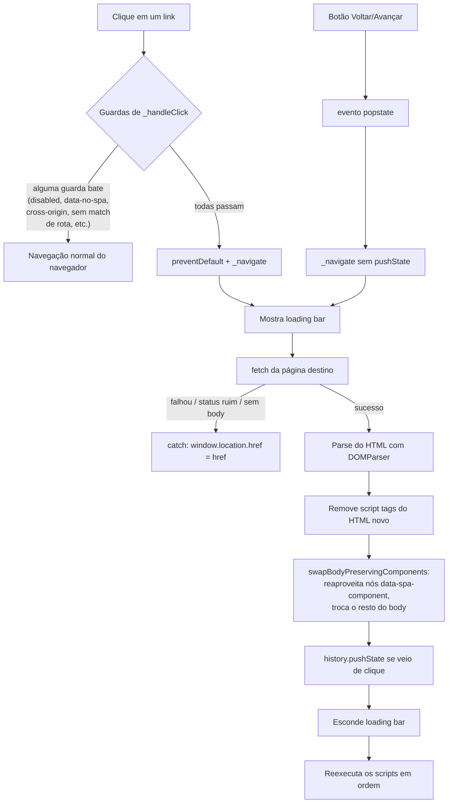

# Como o engine.js funciona

## Resumo

`engine.js` transforma links `<a>` de um site multi-página comum em
navegação estilo SPA: em vez de recarregar a página, ele busca o HTML da
página de destino via `fetch`, troca o conteúdo do `<body>` atual pelo
novo, e reexecuta os `<script>` que vieram junto (que senão ficariam
inertes). Tudo isso acontece dentro de uma única classe, `Engine`,
instanciada uma vez por página com `new Engine({ routes, enabled })`.

Em uma frase por recurso:

| Recurso | O que faz |
|---|---|
| `routes` | Só intercepta links cujo caminho bate com um desses padrões glob (`*` = curinga) |
| `enabled` | Liga/desliga a interceptação sem precisar remover o engine |
| `data-no-spa` | Um link com esse atributo nunca é interceptado |
| Swap de `<body>` | Troca o conteúdo visível sem recarregar a página |
| Reexecução de scripts | Faz `<script>` inline e externos da nova página rodarem de verdade |
| Cache de componente | `data-spa-component="id"` faz um elemento sobreviver à navegação com seu estado intacto |
| Loading bar | Barra fina no topo da tela, visível enquanto o fetch está em andamento |
| `history`/`popstate` | Atualiza a URL e faz Voltar/Avançar do navegador funcionarem |
| Fallback de erro | Se o fetch falhar, cai para uma navegação normal (recarrega a página de verdade) |

## Detalhado

### 1. Inicialização

```js
const engine = new Engine({
  routes: ['*.html', '/site/*'],
  enabled: true,
});
```

O construtor (`engine.js:114-120`) só guarda `routes`/`enabled` e registra
**dois listeners, uma vez só, no nível do documento/janela**:

- `document.addEventListener('click', this._handleClick)`
- `window.addEventListener('popstate', this._handlePopState)`

Isso é proposital: como esses listeners vivem em `document`/`window` (não
em cada `<a>` individual), eles **sobrevivem** à troca de `<body>` — não
precisam ser re-registrados a cada navegação.

### 2. O que acontece quando você clica em um link

`_handleClick` (`engine.js:122-166`) é uma sequência de guardas — na
primeira condição que bater, a função para e o navegador segue com a
navegação normal (reload de página inteira):

1. `enabled` é `false`? Para.
2. Evento já teve `preventDefault()` chamado, ou não foi clique com botão
   esquerdo? Para.
3. Usuário segurou Ctrl/Cmd/Shift/Alt (sinal de "abrir em nova aba")? Para.
4. Não é um clique dentro de um `<a>`, ou o link não tem `href`? Para.
5. O link tem `target="_blank"`? Para.
6. O link tem `data-no-spa`? Para.
7. O link aponta pra outra origem (domínio/porta/protocolo)? Para.
8. O caminho do link não bate com nenhum padrão em `routes`? Para.

Só se **nenhuma** guarda disparar é que o engine assume o controle:
`event.preventDefault()` (impede o reload) e chama `_navigate(link.href, true)`.

### 3. `_navigate`: o coração do engine

`_navigate` (`engine.js:176-210`) é uma função `async` com `try/catch`.

```
mostra loading bar
  │
  ├─ fetch(href)
  │     status não é 2xx? → joga erro
  │
  ├─ pega o HTML como texto
  ├─ faz o parse com DOMParser (vira um "documento" à parte, ainda não visível)
  │     não tem <body> no resultado? → joga erro
  │
  ├─ tira todos os <script> do body novo (senão ficam inertes, ver seção 5)
  ├─ swapBodyPreservingComponents() → troca o <body> visível pelo novo
  ├─ history.pushState() → atualiza a URL da barra de endereço
  ├─ esconde a loading bar
  └─ executa os <script> que foram tirados, em ordem

  se qualquer passo acima falhar (rede caiu, 404, resposta sem <body>...):
  → catch: window.location.href = href (navegação normal, de verdade)
```

O `try/catch` garante que **o usuário nunca fica travado**: qualquer coisa
que dê errado no meio do processo cai para uma navegação tradicional.

### 4. Cache/preservação de componente (`swapBodyPreservingComponents`)

Esta é a parte mais sutil (`engine.js:13-38`). Um swap "ingênuo" seria só
`document.body.innerHTML = novoHtml` — mas isso **destrói e recria todo
mundo**, perdendo qualquer estado (um contador, um filtro digitado, um
checkbox marcado).

O que o engine faz em vez disso:

1. Antes de trocar, procura elementos `[data-spa-component]` que **já
   existem na página atual** e guarda uma referência a eles (o nó DOM de
   verdade, não uma cópia).
2. Olha o HTML **novo** (ainda não inserido na página) e, pra cada
   elemento com o mesmo `data-spa-component`, **substitui o nó novo pelo
   nó antigo** — literalmente enxerta o elemento vivo, com todo seu
   estado, no lugar do que veio do fetch.
3. Só depois disso troca o `<body>` inteiro (removendo os filhos antigos e
   inserindo os novos, que agora já incluem os nós reaproveitados).

Resultado: qualquer elemento marcado com `data-spa-component="algum-id"`
atravessa a navegação como se nunca tivesse saído da tela — sem re-render,
sem "flash", sem perder estado. Veja o botão contador em `example/*.html`
como demonstração.

### 5. Por que os `<script>` precisam ser "reexecutados"

Navegadores **não executam** `<script>` que chegam via `innerHTML` ou
manipulação de DOM comum — é uma proteção de segurança do próprio browser.
`executeScriptsInOrder` (`engine.js:82-111`) contorna isso da única forma
que funciona: para cada `<script>` extraído da página nova, cria um
**elemento `<script>` novo do zero** (copiando atributos e conteúdo) e o
insere no `<body>` — só criar/inserir um elemento `<script>` assim é que
dispara a execução de verdade.

A ordem importa: scripts **inline** rodam na hora e o próximo já começa;
scripts **externos** (`src="..."`) esperam o evento `load`/`error` antes
de deixar o próximo rodar — replicando o comportamento padrão do navegador
para tags `<script>` sem `async`.

### 6. Histórico e botão Voltar/Avançar

- Toda navegação disparada por clique chama `_navigate(href, true)` → o
  `true` faz rodar `history.pushState(null, '', href)`, atualizando a URL
  visível sem recarregar.
- Quando o usuário clica em **Voltar/Avançar** do navegador, o evento
  `popstate` dispara. `_handlePopState` (`engine.js:168-174`) chama
  `_navigate(window.location.href, false)` — o `false` **evita** chamar
  `pushState` de novo (o navegador já mudou a URL sozinho; chamar de novo
  criaria uma entrada de histórico duplicada/bagunçada).

### 7. Loading bar

Uma `<div id="spa-loading-bar">` é criada sob demanda e anexada em
**`document.documentElement` (a tag `<html>`), não em `<body>`** — isso é
proposital: se ela fosse filha do `<body>`, o swap da seção 3 a destruiria
no meio da animação. Ficando fora do `<body>`, ela sobrevive à troca:
`showLoadingBar()` a leva a 80% de largura assim que o fetch começa,
`hideLoadingBar()` completa pra 100% e depois esconde, já com o novo
conteúdo visível.

## Diagrama de fluxo


